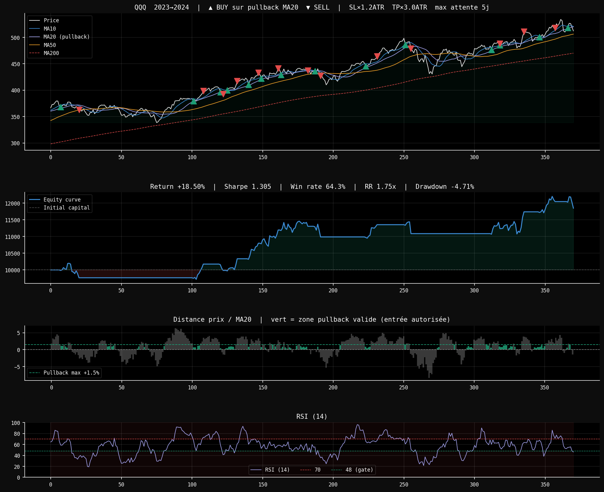

# Algorithmic Trading Bot

A rule-based algorithmic trading system with ATR-based dynamic stops,
multi-indicator scoring, and pullback entry logic.
Built in Python as an independent project.

## Performance (Backtest 2023–2024, QQQ daily)

| Metric | Value |
|---|---|
| Total Return | +18.50% |
| Sharpe Ratio | 1.305 |
| Sortino Ratio | 1.155 |
| Calmar Ratio | 3.925 |
| Max Drawdown | -4.71% |
| Win Rate | 64.3% |
| Profit Factor | 2.74 |
| RR Ratio | 1.75x |
| Total Trades | 14 |

## Strategy Overview

The bot trades QQQ (Nasdaq-100 ETF) on daily timeframes using a
combination of technical rules and dynamic risk management.

### Entry Logic — 2-Step System

**Step 1 — Gate (mandatory conditions):**
- Price above MA200 (bull market confirmed)
- MA50 slope positive over 3 days (uptrend)
- MA20 slope positive over 3 days (short-term momentum)
- 5-day momentum positive
- RSI above 48 (strength confirmed)

**Step 2 — Score (6 technical conditions, need 4/6):**
- Price above MA200
- MA10 > MA20 > MA50 (aligned trend)
- RSI between 48 and 68 (healthy zone)
- MACD histogram positive and above signal
- Bollinger Band position between 0.35 and 0.80
- Volume above 20-day average

**Pullback entry:** After a valid signal, the bot waits up to 5 days
for the price to pull back within 1.5% above MA20 before entering.
This improves entry price and increases the profit margin to take profit.

### Exit Logic — ATR-Based Dynamic Stops

All exits are price-based only (no ML signal exits):

| Exit Type | Level |
|---|---|
| Stop Loss | Entry − 1.2 × ATR |
| Take Profit | Entry + 3.0 × ATR |
| Trailing Stop | Activated after +0.8 × ATR gain |
| Trailing Step | Peak − 1.0 × ATR |

ATR-based stops adapt to real market volatility — wider stops
in volatile markets, tighter stops in calm markets.

### Bear Market Protection

The gate system automatically blocks all entries when:
- Price drops below MA200
- MA50 or MA20 slope turns negative
- 5-day momentum turns negative

During bear markets, the bot holds cash and avoids losses entirely.

## Tech Stack

- **Language:** Python 3
- **Data:** yfinance (Yahoo Finance API)
- **Indicators:** pandas, numpy (custom implementation)
- **Visualization:** matplotlib

## Installation
```bash
git clone https://github.com/barrustatheo/algorithmic-trading-bot
cd algorithmic-trading-bot
pip install -r requirements.txt
python bot.py
```

## Results Chart



## Project Structure